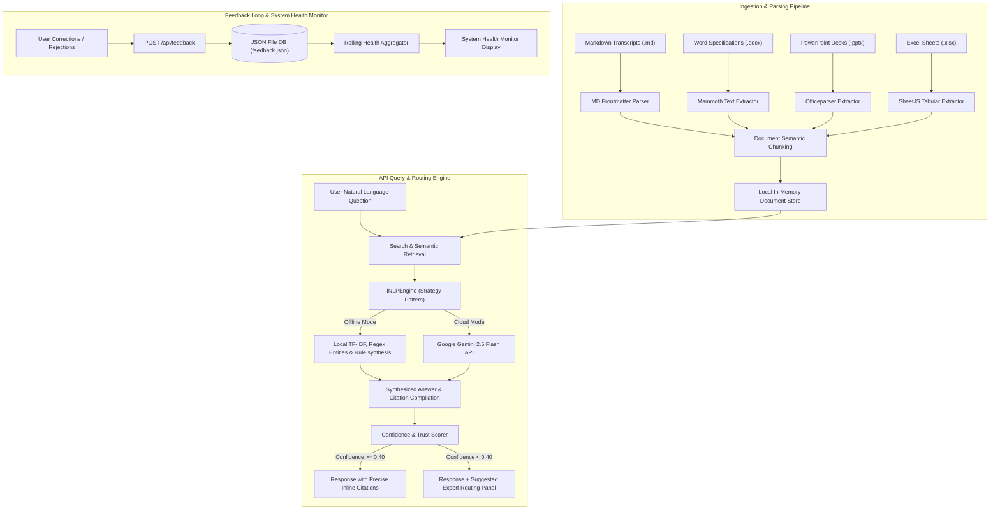

# System Architecture — AetherGrid Knowledge Tracer

This document outlines the core architecture, data ingestion flows, and search pipelines that enable intelligent knowledge tracing across AetherGrid Technologies.

---

## 🏗️ Architectural Overview
AetherGrid Knowledge Tracer is built as a highly responsive, modern, self-contained application using a **Node.js Express backend** and a **React single-page frontend**. 



---

## 🔒 The Strategy Pattern for corporate Deployment
To satisfy the requirement that the application can be seamlessly deployed at a company without using personal credentials, we implement a **Strategy Pattern** for natural language understanding and synthesis.

We declare the typescript interface `INLPEngine`:
```typescript
export interface DocumentChunk {
  id: string;
  filePath: string;
  fileName: string;
  fileType: 'transcript' | 'docx' | 'pptx' | 'xlsx';
  content: string;
  author: string;
  attendees: string[];
  date: string;
  domain: string;
  priority: 'High' | 'Medium' | 'Low';
}

export interface Citation {
  chunkId: string;
  fileName: string;
  filePath: string;
  author: string;
  attendees: string[];
  date: string;
  matchedSnippet: string;
}

export interface SuggestedRouting {
  recipientName: string;
  recipientEmail: string;
  rationale: string;
  draftedQuestion: string;
}

export interface QueryResponse {
  answer: string;
  confidenceScore: number;
  citations: Citation[];
  suggestedRouting?: SuggestedRouting;
  domain: string;
  priority: 'High' | 'Medium' | 'Low';
}

export interface INLPEngine {
  extractMetadata(fileName: string, content: string): Promise<Partial<DocumentChunk>>;
  queryDocuments(query: string, chunks: DocumentChunk[]): Promise<QueryResponse>;
}
```

The system initializes the engine using an environmental switch:
- **`OfflineNLPEngine`**: A zero-dependency engine. It performs tokenization, calculates a local TF-IDF score over document chunks, uses predefined regex rules to find key product mentions, extracts author registries, compiles matching sentences as inline citations, and forms an answer using synthesis templates.
- **`GeminiNLPEngine`**: Operates via `@google/genai` (Google's standard SDK). It chunks text, generates embeddings, computes cosine similarity for semantic retrieval, and sends top context nodes to `gemini-2.5-flash` to return a fully realized structured response including inline citation indexes.

This abstraction allows an IT operations team to easily swap this engine for an internal corporate vector DB (e.g. Pinecone/PgVector) or corporate LLM endpoint (Azure OpenAI/Internal Llama model) by implementing `INLPEngine` in a single file!

---

## 🔎 Traceability and Routing Logic (Exercise 2)

### Citation Mapping
Every claim in a search response must map back to its origin. To do this, the retrieval layer preserves the original `DocumentChunk` object inside a `Citation` array. Clickable reference anchors (e.g., `[1]`, `[2]`) in the synthesized response text correspond exactly to indices in this array. Clicking an anchor highlights the source filename, the primary author/attendees, the date, and the exact text snippet in the UI.

### Low-Confidence Routing Strategy
When the search engine processes a query, it computes a relative relevance score ($C_s \in [0, 1]$). If $C_s < 0.40$:
1.  **Extract Query Entities**: It maps key terms in the query to AetherGrid product domains (e.g., "thermals" $\rightarrow$ Project Helium; "MAE" $\rightarrow$ Project Quantum; "Kubernetes" $\rightarrow$ DevOps).
2.  **Evaluate Expert Directory**: It queries the topic expert directory to locate the employee mapped to the dominant product domain.
3.  **Calculate Rationale**: It scans the index to find how many documents the expert has written or how many meetings they've attended concerning that topic.
4.  **Draft Question**: It builds a professional Slack/Email template inserting the expert's name, their topic domain, and the query terms, presenting it as an editable widget in the UI.

---

## 📊 Instrumentation & Self-Healing Health Score
To track quality degradation (e.g., if garbage text is added or the algorithm begins misinterpreting search intents), the backend calculates rolling system health parameters dynamically at `/api/metrics`:

$$\text{User Rejection Rate} (R) = \frac{\text{Count of Corrections & Rejections in last 30 days}}{\text{Total Queries in last 30 days}}$$

$$\text{Average Search Confidence} (C) = \frac{1}{N} \sum_{i=1}^{N} \text{Confidence Score}_i$$

$$\text{System Health Index} (H) = C \times (1 - R)$$

- **Health Status Evaluation**:
  - $H \ge 0.70$: **System Healthy** (Green glowing status).
  - $0.55 \le H < 0.70$: **Moderate Degradation Warning** (Amber glow). Triggered when rejections increase or index searches are yielding low-confidence results, prompting the team lead to review gaps.
  - $H < 0.55$: **Critical Attention Required** (Red flashing glow). Indicates high user frustration or severely outdated knowledge.
