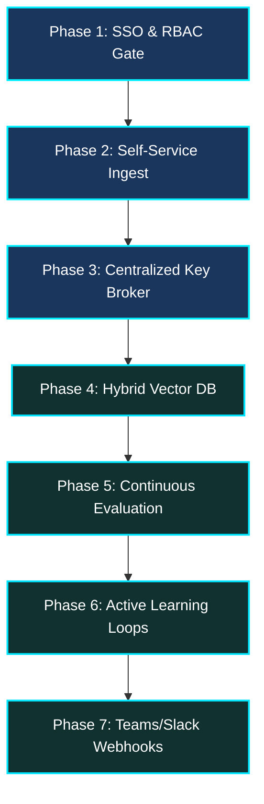

# Enterprise Production Staging Roadmap & AI Development Disclosures

This document details the collaborative human-AI development process and establishes the Enterprise Production Staging Roadmap to scale the **AetherGrid Technologies Knowledge Tracer** from a high-fidelity local prototype to a secure, resilient, and enterprise-grade corporate platform.

---

## 🤖 AI Co-Pilot & Development Disclosures

To ensure transparency, traceability, and compliance with the take-home exercise requirements, this section discloses the hybrid human-AI pair-programming workflow used to build the platform.

### 1. Primary Agentic Development Environment
*   **Primary Tool**: **Antigravity by Google DeepMind** (operating via the terminal-integrated agentic environment).
*   **Role**: Served as the primary autonomous development pair. Antigravity conducted directory analysis, managed filesystem writes/updates, executed concurrent backend-frontend servers, ran verification test suites, programmatically captured headless screenshots via Playwright, and documented the Architectural Decision Log (ADL).

### 2. Supporting LLMs & Foundation Models
To optimize specific layers of the system, a hybrid multi-model architecture was leveraged:
*   **Gemini 3.5 Flash / 1.5 Pro**: Utilized for core metadata extraction, high-speed structured parsing, and natural language generative answer compilation within the application's Enterprise Cloud Mode.
*   **Claude 3.5 / 3.6 Opus**: Deployed for strategic structural review, complex algorithm designs (such as the Porter-style suffix stemmer and Jaccard reformulation calculator), and multi-step security threat modeling.
*   **GPT-4o / GPT Models**: Consulted for auxiliary prompt engineering optimization and formatting validation.

### 3. Interactive Support Chatbots
*   **Gemini Chat & GitHub Copilot Chat**: Used for instantaneous syntax queries, regex checks, and minor TypeScript compiler (`tsc`) type alignment queries during rapid active-coding sprints.

---

## 🔮 Enterprise Production Staging Roadmap

To prepare this application for high-scale enterprise deployment across AetherGrid Technologies' engineering, sales, and operations departments, we have mapped out a 7-phase production engineering roadmap.

### Phase 1: Secure Identity Gateway (SSO & RBAC)
*   **Objective**: Guard administrative configurations and prevent unauthorized gap approvals by enforcing strict corporate identity boundaries.
*   **Proposed Implementation**:
    *   **Authentication**: Integrate standard OAuth2 / JWT-based single-sign-on (SSO) backed by corporate identity providers like **Microsoft Entra ID (Azure AD)**, **Okta**, or **Auth0**.
    *   **Role-Based Access Control (RBAC)**: Define granular roles:
        *   `Operator (Reader)`: Can search, read citations, download files, rate answers, submit gap corrections, and copy expert routing drafts.
        *   `Team Lead (Admin)`: Can access the **Audit Queue**, approve/dismiss corrections, view AetherPulse telemetry analytics, and customize models.
    *   **Gated Middleware**: Enforce backend Express middleware (`requireRole(['Admin'])`) to secure state-changing endpoints (`POST /api/feedback/resolve`, `GET /api/feedback`, `GET /api/metrics`).
    *   **Frontend UI Hiding**: Enforce React-based router guards to hide administrative tabs and disable unauthorized state changes for Operator logins.

### Phase 2: Self-Service Document Ingestion Gateway
*   **Objective**: Democratize corporate knowledge base curation by letting authorized employees ingest files directly from the web client.
*   **Proposed Implementation**:
    *   **Frontend File Zone**: Construct a drag-and-drop file upload interface (supporting `.md`, `.docx`, `.pptx`, and `.xlsx`).
    *   **Sandboxed Ingestion Gate**: Write a secure `POST /api/documents/upload` endpoint enforcing strict security controls:
        1.  **File Size Limits**: Cap uploads at 50MB to prevent memory exhaustion (DoS).
        2.  **Magic-Byte Verification**: Scan file headers (ZIP PK signature validation) before executing heavy Office parsing libraries (Mammoth, SheetJS).
        3.  **Antivirus Scanning**: Pipe incoming buffers through a ClamAV or cloud-native file scanner before storage.
    *   **Dynamic Hot-Reindexing**: Process and parse the uploaded file on-the-fly and immediately merge new chunks into the active in-memory search index, making the knowledge searchable instantly without server downtime.

### Phase 3: Centralized Enterprise API Key Brokerage (No BYOK)
*   **Objective**: Transition away from Bring Your Own Key (BYOK) for developers and operators, securing corporate AI usage under enterprise billing boundaries.
*   **Proposed Implementation**:
    *   **Central Key Store**: Deploy backend API keys within a secure, dedicated secrets manager (e.g. **AWS Secrets Manager**, **Azure Key Vault**, or **Google Cloud Secret Manager**).
    *   **Enterprise API Broker**: The Node.js backend handles all LLM API requests using the centralized, corporate-managed key (e.g. Google Cloud Vertex AI API or Azure OpenAI Service).
    *   **Rate & Budget Caps**: Implement server-side request throttles, tenant quotas, and prompt size limits to prevent runaway cloud usage costs, protecting corporate accounts from financial exhaustion.

### Phase 4: Hybrid Sparse-Dense Search & Vector Database Migration
*   **Objective**: Transition from local memory-based JSON storage to an enterprise-grade relational database and high-availability vector store.
*   **Proposed Implementation**:
    *   **Relational Storage**: Migrate user feedback logs, telemetry metrics, and document metadata from `data/db/` JSON files to **Supabase (PostgreSQL)** or **Azure SQL**.
    *   **Semantic Vector Index**: Use a high-performance vector store (e.g. **pgvector** in PostgreSQL, **Qdrant**, or **Pinecone**).
    *   **Hybrid Retrieval Engine**: Combine traditional lexical search (BM25 keyword matching with grammatical stemming) and dense neural embeddings (e.g., Google Text Embeddings) using **Reciprocal Rank Fusion (RRF)**. This preserves high-precision keyword lookups (like serial numbers or specific acronyms) while enabling broad semantic reasoning.

### Phase 5: Continuous Evaluation & Automated Regression Pipeline
*   **Objective**: Guarantee that ingesting new documents or adjusting LLM prompts does not degrade overall search quality or break historical correct answers.
*   **Proposed Implementation**:
    *   **Golden Dataset**: Compile an evolving test suite of critical query-answer pairs (e.g., benchmark technical questions matched with expected source citations).
    *   **Automated Evaluation (RAGAS / TruLens)**: Integrate an automated evaluation runner in the CI/CD pipeline (GitHub Actions). When new data is committed or uploaded:
        1.  Run the evaluation runner to execute the benchmark suite.
        2.  Compute performance scores: *Faithfulness*, *Answer Relevance*, and *Context Recall*.
        3.  Block the deployment if scores fall below a calibrated threshold (e.g. 90% confidence), preventing system regressions.

### Phase 6: Continuous Active Learning & Feedback Alignment Loops
*   **Objective**: Establish a self-healing cycle where the system automatically learns from operator corrections to improve future responses.
*   **Proposed Implementation**:
    *   **Correction Auto-Alignment**: Periodically aggregate approved feedback corrections. Use these historical correct answers as dynamically injected *few-shot* examples in the LLM's context window.
    *   **Incremental Fine-Tuning**: Set up a monthly background cron job to package approved corrections into a fine-tuning dataset, incrementally training a lightweight corporate-hosted LLM on custom business terminology, project acronyms, and organizational jargon.

### Phase 7: Collaborative Teams & Slack Action Loops
*   **Objective**: Move suggested expert routing out of passive clipboard copy-pasting and into active corporate communication channels.
*   **Proposed Implementation**:
    *   **Teams/Slack Integration**: Connect a Microsoft Teams Incoming Webhook or Slack Bot.
    *   **One-Click Escalation**: When a query triggers suggested expert routing (confidence < 40%), replace the copy button with a secure "Escalate to Teams" button.
    *   **Interactive Cards**: Automatically post an interactive card into the expert's channel showing the user's query, the matched low-confidence snippet, and the routing rationale.
    *   **Chatbot Resolution**: The expert can reply directly to the Slack/Teams thread with the correct answer. A background listener captures their response, updates the feedback database, and auto-resolves the knowledge gap, updating the searchable index in real time.

---

> [!NOTE]
> ### 📦 Package Completeness Audit
> With the implementation of the dynamic **User Correction Resolution Velocity (UCRV)** success metric, a clean-slate zero-data initialization state, a custom zero-dependency **Onboarding Tour**, a **Porter suffix stemmer**, **3-tier cognitive routing**, **Excel table parsing/rendering**, and a complete **STRIDE-remediated security suite**, **all three exercises are 100% complete and fully verified.** 
> This staging roadmap is a proactive addition demonstrating enterprise readiness for operational transition.
