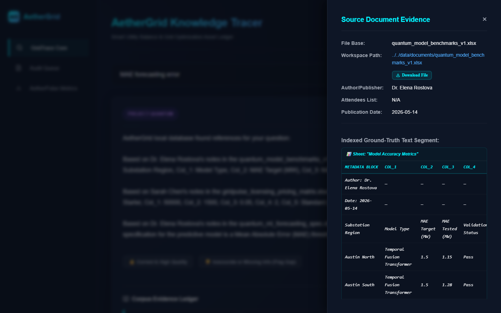
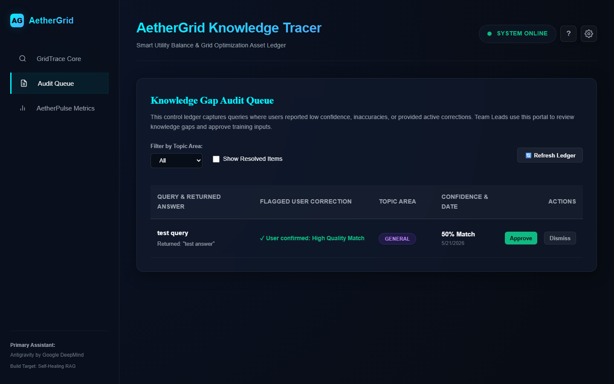
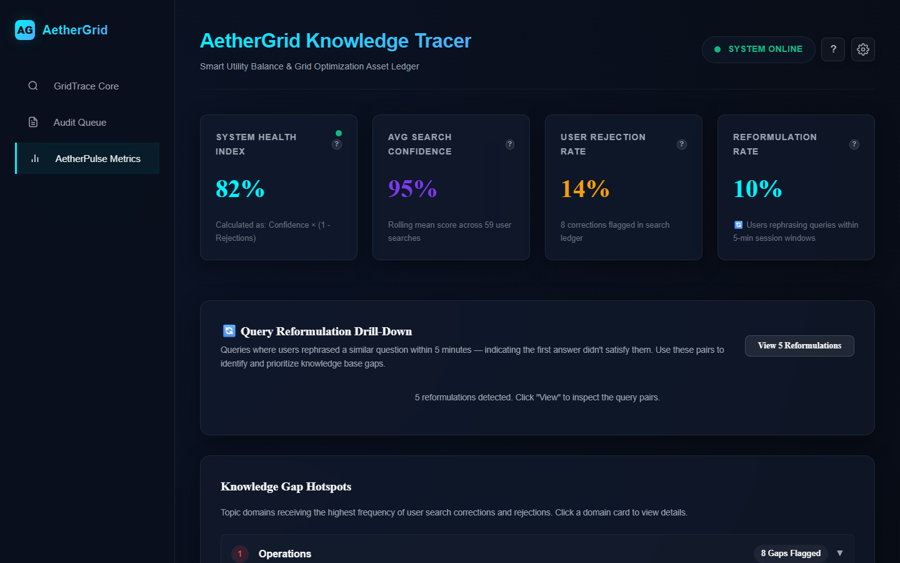

# AetherGrid Knowledge Tracer — Comprehensive User Guide

Welcome to the **AetherGrid Knowledge Tracer** User Guide. This system is a self-healing corporate knowledge engine designed for high-tech energy startups. It allows operators, administrators, and team leads to seamlessly search, audit, and analyze natural language meeting transcripts and structural Microsoft Office formats (`.docx`, `.pptx`, `.xlsx`), backed by advanced multi-hop traceability, expert routing, self-healing correction loops, and system health metrics.

---

## 🏛️ System Interface Overview

AetherGrid Knowledge Tracer features a highly responsive, futuristic dark-theme interface styled entirely in Vanilla CSS (with responsive glassmorphic cards and glowing status animations). 

The console is organized into a sidebar containing **three distinct workspaces**:
1.  **GridTrace Core**: The natural language AI Search & Citation interface.
2.  **Audit Queue**: The administrative dashboard for team leads to review and approve user corrections.
3.  **AetherPulse Metrics**: The system telemetry board showing rolling confidence, rejection rates, and search reformulation friction.

Additionally, a gear icon in the top header slides open the **Cloud LLM & Ingestion Gateway Strategist** drawer to toggle cloud semantic engines and trigger file re-indexing.

---

## 🔍 Section 1: GridTrace Core (AI Search & Citation Drawer)



### 1.1 Executing Natural Language Queries
The search bar accepts natural language questions. You do not need structured SQL commands or precise keywords.
*   **Example 1**: *"What is Elena's MAE target?"*
*   **Example 2**: *"Project Quantum model benchmarks MAE"*
*   **Example 3**: *"Substation voltage fluctuations"*

### 1.2 Inline Citations & The Provenance Drawer
*   **Synthesized Answers**: The search engine returns a fluid, synthesized answer drawing from multiple documents in the corpus. Important claims are linked with inline numbered citations (e.g., `[1]`, `[2]`).
*   **Opening Provenance**: Clicking any inline citation number or clicking a source file in the citation list slides open the **Provenance Drawer** on the right side of the screen.
*   **Metadata Disclosed**: The drawer shows the complete background of the claim:
    *   **Source File**: Virtualized path (e.g., `data/documents/quantum_ml_forecasting_spec.docx`).
    *   **Author / Facilitator**: The primary author or meeting organizer (e.g., `Dr. Elena Rostova`).
    *   **Attendees**: Complete participant list for meeting transcripts.
    *   **Document Date**: The exact date the file was generated or the meeting occurred.
    *   **Matched Segment**: The exact paragraph or context block that matched your search.

### 1.3 Excel Tabular Layouts
When a citation points to an Excel spreadsheet (`.xlsx` or `.xls` file), the Provenance Drawer automatically parses the spreadsheet data and renders it as an interactive, highly readable **HTML Table Grid** with borders, distinct headers, and zebra-striped rows rather than messy, unformatted text blocks.

### 1.4 Secure File Downloads
At the top of the Provenance Drawer, next to the virtualized path, users can click the **Download Source** button. This securely fetches the original file from the server via an authenticated bridge with strict path traversal filters, allowing you to review the raw source document on your desktop immediately.

---

## 🧭 Section 2: Cognitive Expert Routing & Gaps

### 2.1 Triggering Fallback Routing
When a query confidence score drops below **40%**, indicating that the local index does not contain a strong match, the system automatically triggers its **3-Tier Scoping & Expert Routing** engine.

### 2.2 The suggested expert card
Below your search results, a glowing orange card slides in revealing:
1.  **Subject-Matter Expert**: The primary contact responsible for that technical domain (e.g., `Marcus Vance` for grid hardware).
2.  **Contact Email**: Direct corporate email for instant outreach.
3.  **Rationale**: An explanation of why this expert was chosen, referencing the closest related matching file or historic meeting attendee metadata.
4.  **Drafted Message**: A fully personalized, editable message template specifically tailored with your question, ready for copying.
5.  **Copy Action**: Click "Copy Teams Message" to copy the text to your clipboard.

### 2.3 Tier 3 Out-of-Scope Null Routing
If a user searches for off-topic questions (e.g., *"What is the weather today?"* or *"Who is the president?"*), the system recognizes the query as fully out of scope. Rather than creating a false expert alert, it displays a friendly **"Query Outside Knowledge Scope"** card, advising the user that the question does not match any corporate domains.

---

## 👍 Section 3: Self-Healing Correction Loop

If an answer is incorrect, incomplete, or outdated, you can actively heal the system:
1.  Click the **👎 Inaccurate** button below the answer.
2.  An input card will appear prompting: *"Please provide the correct information here..."*
3.  Type the golden answer (e.g., *"Actually, the target MAE was updated to 0.08 in the May meeting"*).
4.  Click **Submit Correction**.
5.  This creates a high-priority gap transaction stored inside `data/db/feedback.json`, which enters the review queue.

---

## 🖥️ Section 4: Operator Audit Queue (Team Lead Portal)



The Audit Queue is the nerve center where administrators and team leads review user frustrations and perform index maintenance.

### 4.1 Navigating the Queue
*   **Columns**: Each row displays the original user query, the answer they rejected, the user's correction text, the topic domain, and actions.
*   **Filtering**: Filter the queue by **Topic Domain** (e.g., Project Quantum, Project Helium, DevOps) or by **Resolution Status** (Pending vs Resolved).
*   **Audit Frequency**: The queue automatically polls the backend every 10 seconds to display new user flags in real time.

### 4.2 Actions: Approve vs Dismiss
*   **Approve Correction**: Clicking Approve compiles the user's golden correction into a virtual high-priority document chunk and **injects it directly into the active RAM search index in real time**. 
    *   *Self-Healing Magic*: Future searches for that query or similar topics will immediately return the approved correction as the top hit, correcting the knowledge gap instantly without requiring a server reboot!
*   **Dismiss**: Clicking Dismiss archives the feedback item, marking it as reviewed without updating the search matrix.

---

## 📊 Section 5: AetherPulse Metrics & Telemetry



The AetherPulse dashboard provides real-time system performance telemetry to catch quality issues before users report them.

### 5.1 Widescreen Telemetry Row
Four interactive KPI cards are displayed in a widescreen responsive row:
1.  **System Health Index**: Combined metric calculating retrieval stability ($C \times (1-R)$). Features a pulsing color LED representing system status:
    *   **Green (Healthy)**: Index is highly stable.
    *   **Amber (Degraded)**: Minor degradation (rejections are rising or search confidence is dropping).
    *   **Red (Critical)**: High user rejections; index needs immediate auditing.
2.  **Average Search Confidence**: The rolling average confidence score of all searches.
3.  **User Rejection Rate**: The percent of searches flagged as incorrect or corrected.
4.  **Reformulation Rate**: Measures search friction (Jaccard similarity $\ge 40\%$ on consecutive queries in a 5-minute window).

### 5.2 Click-to-Reveal Explanation Overlays
Clicking the `?` icon in the top right corner of any KPI card slides up a beautiful glassmorphic overlay containing the **Metric Description**, **Mathematical Formula**, and a **Real-World Example** of how it is computed.

### 5.3 Reformulation Drill-Down Panel
Clicking the **Reformulation Rate** card slides out a stateful drill-down ledger revealing actual anonymous search reformulation pairs (e.g., *"how to calibrate thermal edge"* $\rightarrow$ *"thermal node calibration steps"*). This highlights exactly where users are struggling to find information, allowing you to proactively add missing documentation.

### 5.4 SVG Performance Trends & Hotspots
*   **3-Day & 30-Day Line Chart**: Renders mathematical curves representing metrics history.
*   **Knowledge Gap Hotspots**: Expandable ledgers broken down by domain, highlighting which projects have the most unresolved user corrections.

---

## ⚙️ Section 6: Ingestion Gateway & Cloud BYOK Settings

Click the gear icon in the header to configure the system:
1.  **AI Engine Selection**: Toggle between **Local Offline Mode** (zero keys, high-performance BM25/TF-IDF) or elevate to generative cloud RAG by selecting **Google Gemini API** or **Azure OpenAI**.
2.  **Bring-Your-Own-Key (BYOK)**: Enter your secure corporate keys with visibility toggles.
3.  **Hot Ingestion Re-Index**: Click "Sync & Re-index Workspace" to force scan `/data/` and update your search matrix instantly without server downtime.

---

## 🔮 Section 7: Future Features Roadmap

### 7.1 Secure Role-Based Access Control (RBAC) & User Authentication Gateway
To transition AetherGrid Knowledge Tracer into an enterprise-grade corporate platform, we are planning a comprehensive User Management and Authentication gateway:
*   **Objective**: Prevent unauthorized configuration modifications and enforce strict division of labor by gating administrative actions behind secure, role-based login boundaries.
*   **Proposed Architecture & Flow**:
    *   **Authentication Hub**: Integrate an enterprise Identity Provider (IdP) such as **Auth0**, **Microsoft Entra ID (Azure AD)**, or **Supabase Auth** using JWT (JSON Web Tokens).
    *   **Role Definitions**:
        *   `Standard Operator (Reader)`: Authenticated user who can query the knowledgebase, view citation drawers, rate responses, submit corrections, and copy suggested expert routing details. Access to the Audit Queue, System Analytics, and Cloud settings is hidden and strictly blocked.
        *   `Team Lead / Admin (Operator)`: Full administrative rights to access the Audit Queue, approve/dismiss corrections, view AetherPulse Telemetry details, and toggle Cloud BYOK API key models.
    *   **Frontend Guardrails**: Enforce stateful React Router navigation guards. If a standard Operator attempts to view `/audit` or `/analytics`, they are redirected to `/search` with a notification.
    *   **Backend Hardening Middleware**: Gate Express endpoints like `POST /api/feedback/resolve`, `GET /api/feedback`, `GET /api/metrics`, and `POST /api/ingest` with role-verification middleware:
        ```typescript
        export const requireRole = (allowedRoles: string[]) => {
          return (req: any, res: any, next: any) => {
            const user = req.user; // Set by JWT validation middleware
            if (!user || !allowedRoles.includes(user.role)) {
              return res.status(403).json({ error: "Access Denied: Insufficient Permissions" });
            }
            next();
          };
        };
        ```
    *   **Immutable Audit Logs**: Record which administrative account approved or dismissed each correction, creating a cryptographically sound ledger for corporate compliance.
